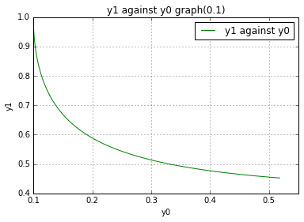
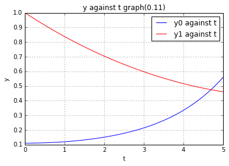
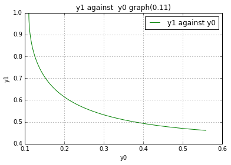

UECM3033 Assignment #3 Report
========================================================

- Prepared by: **see boon chai**
- Tutorial Group: T3

--------------------------------------------------------

## Task 1 --  Gauss-Legendre formula

The reports, codes and supporting documents are to be uploaded to Github at: 

[https://github.com/seeboonchai/UECM3033_assign3](https://github.com/your_github_id/UECM3033_assign3)

Explain how you implement your `task1.py` here.

Explain how you get the weights and nodes used in the Gauss-Legendre quadrature.

Before i implement Gauss-Legendre integration, i will set the interval between -1 and 1 , then i used Lagrange polynomial to transform the interval ,can see the equation in code which is y = a((x-1)/(-1-1)) + b((x+1)/(1+1)) and the jacobian for the transformation is (b-a)/2. Next, leggauss from the module numpy.polynomial.legendre is use to obtain the weights and nodes (from this situation, i stored them into x and w ) in the Gauss-Legendre quadrature. when finish transformed the nodes x into a variable called y, the answer i get is using the dot product of  a function f(y) and w together with the jacobian (b-a)/2.

Explain how you get the weights and nodes used in the Gauss-Legendre quadrature.

By using leggauss from the module numpy.polynomial.legendre to get the weights and nodes after that stored into the variable x and w.

---------------------------------------------------------

## Task 2 -- Predator-prey model

Explain how you implement your `task2.py` here, especially how to use `odeint`.

A function called system is defined to store the ODE system which has exactly 4 parameters, inity, t = np.linspace(0, 5, 100), a and b. Then , the value is stored into a, b and y. The t = np.linspace(0, 5, 100) is actually means 100 uniform partition from t = 0 to 5.Finally,I implement the odeint from the module scipy.integrate to solve nonlinear ODE system.

Put your graphs here and explain.

this is the graph of y against t (0.1)

this is the graph of y1 against y0 (0.1)

this is the graph of y against t (0.11)

this is the graph of y1 against y0 (0.11)

Is the system of ODE sensitive to initial condition? Explain.

-----------------------------------
The system ODE is not sensitive to initial condition because the difference between the graph for both case is not significant.

last modified: change your date here
